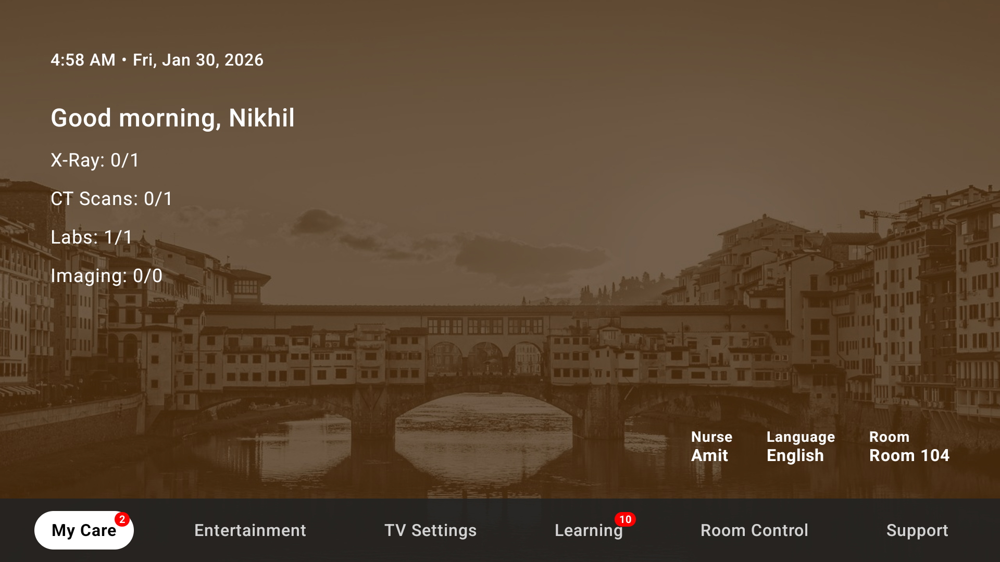

---

# Smart Hospital TV App

## Overview

Smart Hospital TV App is an Android TV–based healthcare solution designed to enhance the in-room patient experience. It provides real-time health statistics, educational content, entertainment access, and comfort features through an easy-to-use bottom navigation interface.

## Features

* **Home Dashboard** – Overview of patient health and key statistics
* **Health Section** – Displays BP, heart rate, and other vital statistics
* **Doctor & Room Details** – Shows assigned doctor and hospital room information
* **Education** – Health and disease awareness videos for patients
* **Entertainment** – Redirects to OTT apps like Prime Video, Hotstar, MX Player, and Zee5
* **Comforts** – Eye-soothing, high-quality image galleries
* **Pairing** – Mobile-to-TV casting for personalized content
* **Feedback** – Patients can submit feedback directly through the app

## Target Platform

* Android TV / Smart TV (Hospital In-room Systems)

## Use Case

Designed for hospitals to improve patient engagement, education, and comfort while providing easy access to entertainment and personalized health information.

## Tech Stack

* Android (Kotlin)
* Android TV UI
* Modern navigation with Bottom Bar
* Optimized for large-screen experiences

## Future Enhancements

* Multi-language support
* Voice navigation
* Remote health data integration
